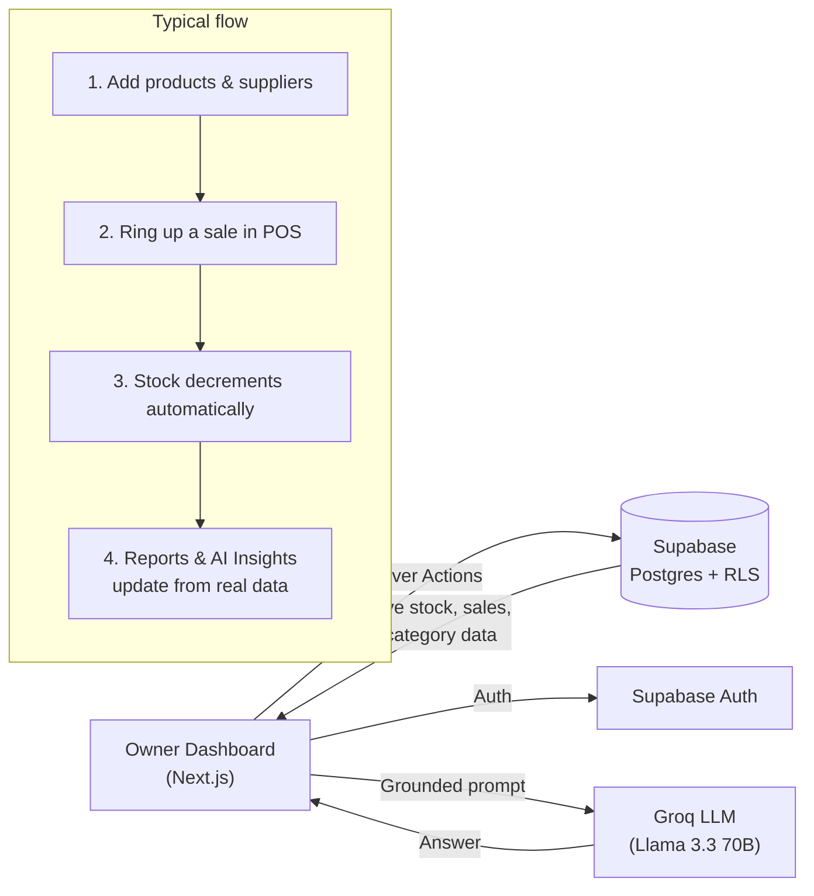

<div align="center">

# 🛒 Bharat Inventory Manager AI

### *Smarter Stock. Sharper Decisions. Zero Waste.*

**The next-generation, AI-powered inventory & business management platform for India's retail shops.**

[](https://nextjs.org)
[](https://www.typescriptlang.org)
[](https://tailwindcss.com)
[](https://supabase.com)
[](https://groq.com)
[](https://vercel.com)
[](./LICENSE)
[](https://github.com/kushagra486/Bharat-Inventory-Manager-/pulls)

**[🚀 Live Demo](https://bharat-inventory-manager.vercel.app)** · [Vision & Roadmap](./VISION.md) · [Report a bug](https://github.com/kushagra486/Bharat-Inventory-Manager-/issues)

</div>

<br />

<div align="center">
  
</div>

<br />

---

## 📖 Table of contents

- [About](#-about)
- [Vision, mission & motto](#-vision-mission--motto)
- [Screenshots](#-screenshots)
- [Features](#-features)
- [Tech stack](#-tech-stack)
- [How it works](#-how-it-works)
- [Getting started](#-getting-started)
- [Environment variables](#-environment-variables)
- [Deployment](#-deployment)
- [Project structure](#-project-structure)
- [Roadmap](#-roadmap)
- [Contributing](#-contributing)
- [License](#-license)

<br />

## 🧭 About

**Bharat Inventory Manager AI (BIM AI)** is an open-source, cloud-based
inventory and business management platform built for the shop around the
corner — grocery stores, medical stores, electronics shops, and every small
Indian retailer who needs real software without enterprise-software prices.

It's a real, working app, not a mockup: authentication, row-level-secured
multi-tenant data, a point-of-sale checkout that actually decrements stock,
revenue reports computed from real transactions, and an AI assistant that
answers questions grounded in your live inventory — all free to run on
generous free tiers (Supabase, Vercel, Groq).

## 🎯 Vision, mission & motto

| | |
|---|---|
| **Motto** | *Smarter Stock. Sharper Decisions. Zero Waste.* |
| **Vision** | A fully cloud-based, open-source, AI-native ERP that any small Indian business — retail, grocery, medical, electronics, or wholesale — can run for free, with a connected customer-facing app in real time. |
| **Mission** | Give small retailers the same caliber of inventory intelligence that large chains pay lakhs for — demand forecasting, restock suggestions, expiry-loss prevention — for the price of an internet connection. |

Read the full long-term product vision, including modules not yet built
(customer app, employee dashboard, multi-store support), in
**[VISION.md](./VISION.md)**.

## 📸 Screenshots

<table>
  <tr>
    <td width="50%"><p align="center"><sub>Products — master-detail inventory view</sub></p></td>
    <td width="50%"><p align="center"><sub>Sales · POS — real checkout, real stock decrement</sub></p></td>
  </tr>
  <tr>
    <td width="50%"><p align="center"><sub>AI Insights — Groq-powered chat, grounded in your data</sub></p></td>
    <td width="50%"><p align="center"><sub>Reports — revenue & category breakdowns</sub></p></td>
  </tr>
</table>

## ✨ Features

Every module below is a **real, working feature** backed by Postgres +
Row-Level Security — not a mockup.

| Module | What it does |
|---|---|
| 🔐 **Auth** | Email/password sign-up & login via Supabase Auth, RLS-scoped per user |
| 📦 **Products** | Master-detail inventory: search, category/low-stock filters, batch & expiry tracking |
| 🏷️ **Categories** | Shared defaults + per-shop custom categories |
| 🚚 **Suppliers** | Contact management, linked to products |
| 👥 **Customers** | Profiles with real order-count & lifetime-value stats |
| 🛒 **Sales · POS** | Product grid → cart → checkout, creates a real order, decrements stock, blocks overselling |
| 📋 **Orders** | Every transaction rung up through the POS, with editable status |
| 📊 **Reports** | Revenue & category charts, average order value, CSV/PDF export — computed from real orders |
| 🤖 **AI Insights** | Restock suggestions, expiry-risk alerts, best-sellers, and a Groq-powered chat assistant grounded in your live data |
| ⚙️ **Settings** | Business profile, account info, expiry-notification preferences |

## 🛠️ Tech stack

| Layer | Technology |
|---|---|
| Framework | [Next.js 16](https://nextjs.org) (App Router, Server Actions, TypeScript) |
| UI | [Tailwind CSS v4](https://tailwindcss.com) + [shadcn/ui](https://ui.shadcn.com) on [Base UI](https://base-ui.com) |
| Design system | Custom **"Nocturne"** dark theme |
| Database & Auth | [Supabase](https://supabase.com) — Postgres, Row-Level Security, Auth |
| AI | [Groq](https://groq.com) (Llama 3.3 70B) — real-time inference, free tier |
| Hosting | [Vercel](https://vercel.com) — auto-deploy on every push to `main` |
| CI/CD | GitHub Actions — lint, build, and deploy |
| Icons | [Lucide](https://lucide.dev) |

## 🔄 How it works



## 🚀 Getting started

```bash
git clone https://github.com/kushagra486/Bharat-Inventory-Manager-.git
cd Bharat-Inventory-Manager-
npm install
cp .env.local.example .env.local
npm run dev
```

Open [http://localhost:3000](http://localhost:3000). Unauthenticated users are
redirected to `/login`; sign up at `/signup` to create an owner account.

### Database setup

If you're pointing this at your **own** fresh Supabase project (rather than
reusing the one in `.env.local.example`), run the schema in your project's
SQL Editor. The base schema (products, categories, suppliers, auth trigger,
seed categories) and the sales/CRM extension (customers, sales_orders,
sales_order_items) are documented in [VISION.md](./VISION.md) and this
project's commit history — or ask in an issue and it'll be added here as a
proper `supabase/` migrations folder.

## 🔑 Environment variables

| Variable | Required | Description |
|---|---|---|
| `NEXT_PUBLIC_SUPABASE_URL` | ✅ | Supabase project API URL |
| `NEXT_PUBLIC_SUPABASE_PUBLISHABLE_KEY` | ✅ | Supabase publishable (anon) key — safe to expose client-side |
| `GROQ_API_KEY` | Optional | Server-only. Enables the AI Insights chat. Get a free key at [console.groq.com/keys](https://console.groq.com/keys) |

`.env.local.example` ships pre-filled with a working Supabase URL/key so
`npm run dev` works out of the box. Rotate these if you fork this project for
your own deployment, and never commit a real `GROQ_API_KEY`.

## 📦 Deployment

**Vercel** (recommended, and what powers the [live demo](https://bharat-inventory-manager.vercel.app)):

1. Import this repository at [vercel.com/new](https://vercel.com/new)
2. Add the environment variables above under Project Settings
3. Deploy — every push to `main` redeploys automatically

**GitHub Actions** (`.github/workflows/`):

- `ci.yml` — lint + build on every push and pull request
- `deploy.yml` — deploys to Vercel via the Vercel CLI on every push to `main`, using the same build Vercel's own Git integration would produce (belt-and-suspenders / gives you deploy logs in Actions). Needs three repository secrets: `VERCEL_TOKEN`, `VERCEL_ORG_ID`, `VERCEL_PROJECT_ID`.

## 🗂️ Project structure

```
src/
  app/
    login/, signup/            # Auth pages (Supabase Auth, email+password)
    dashboard/
      layout.tsx               # Sidebar shell, requires an authenticated user
      page.tsx                 # Overview: stats, category breakdown, alerts
      products/                # Products CRUD (master-detail)
      categories/, suppliers/  # Categories & Suppliers CRUD
      customers/               # Customer CRM
      sales/                   # POS: cart + real checkout
      orders/                  # Order history & status
      reports/                 # Revenue/category analytics + CSV/PDF export
      ai/                      # AI Insights + Groq-powered chat
      settings/                # Business profile, account, notifications
    auth-actions.ts            # signIn / signUp / signOut server actions
  components/
    app-sidebar.tsx            # Dashboard navigation
    ui/                        # shadcn/ui components
  lib/
    insights.ts                # Shared real-data context for AI Insights
    supabase/                  # Browser/server clients, middleware, types
  proxy.ts                     # Route protection (Next.js 16 proxy convention)
```

## 🗺️ Roadmap

Everything in the Owner Dashboard above is built and live. Still ahead, per
the original product vision (see [VISION.md](./VISION.md) for the full list):

- 📱 Customer-facing shopping app
- 👷 Employee dashboard with role-based permissions
- 🖼️ Barcode/OCR invoice scanning, voice assistant
- 🔔 Real push/email delivery for expiry reminders (the settings exist; the sender doesn't yet)
- 💳 Payments (Razorpay/Stripe), multi-store support, GST invoicing

## 🤝 Contributing

This is open source — PRs welcome.

1. Fork the repo
2. Create a branch: `git checkout -b feature/my-feature`
3. Commit: `git commit -m 'Add my feature'`
4. Push and open a Pull Request

## 📜 License

[MIT](./LICENSE) — free for personal and commercial use.

<br />

<div align="center">

Made with ❤️ for India's small retailers.

</div>
