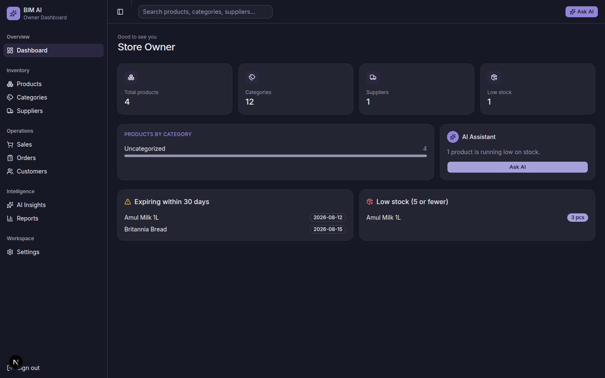
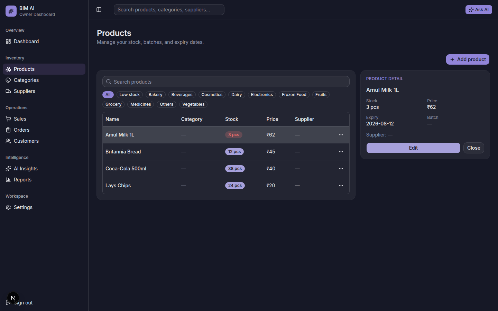
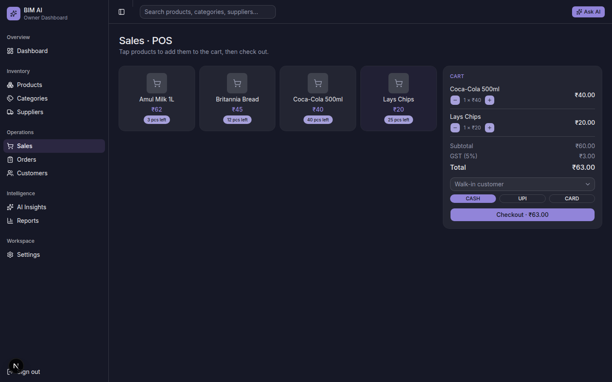
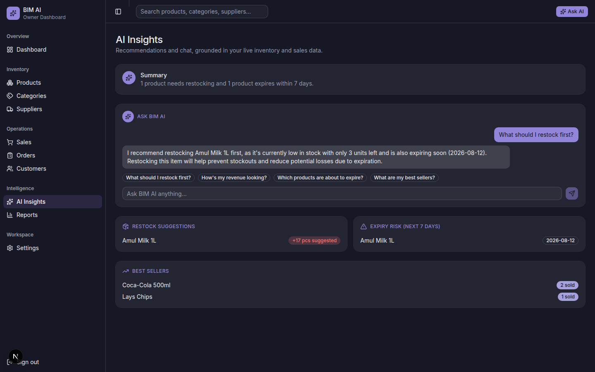
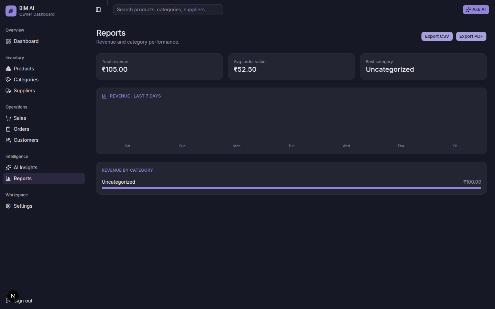
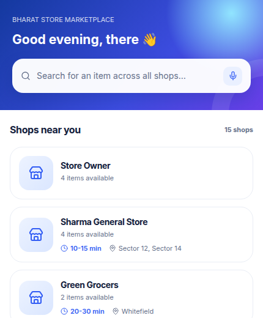
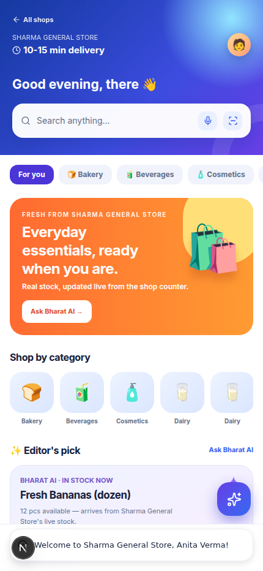
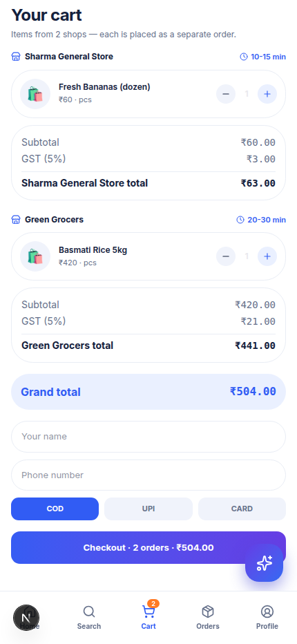
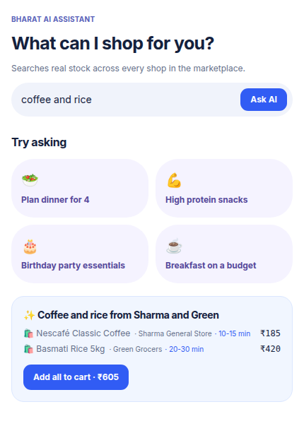
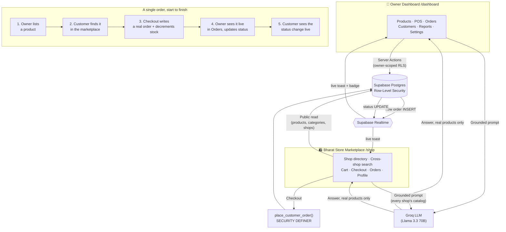

<div align="center">

# 🛒 Bharat Inventory Manager AI

### *Smarter Stock. Sharper Decisions. Zero Waste.*

**The next-generation, AI-powered inventory & business management platform for India's retail shops.**

[](https://nextjs.org)
[](https://www.typescriptlang.org)
[](https://tailwindcss.com)
[](https://supabase.com)
[](https://groq.com)
[](https://vercel.com)
[](./LICENSE)
[](https://github.com/kushagra486/Bharat-Inventory-Manager-/pulls)

**Two connected apps, one platform: an Owner Dashboard for retailers and the
Bharat Store marketplace for their customers — sharing one live database.**

**🏪 [Owner Dashboard — Live](https://bharat-inventory-manager.vercel.app)** ·
**🛍️ [Bharat Store Marketplace — Live](https://bharat-inventory-manager.vercel.app/shop)** ·
[Vision & Roadmap](./VISION.md) · [Report a bug](https://github.com/kushagra486/Bharat-Inventory-Manager-/issues)

</div>

<br />

<div align="center">
  
</div>

<br />

---

## 📖 Table of contents

- [About](#-about)
- [Two apps, one platform](#-two-apps-one-platform)
- [Vision, mission & motto](#-vision-mission--motto)
- [Screenshots — Owner Dashboard](#-screenshots--owner-dashboard)
- [Screenshots — Bharat Store Marketplace](#-screenshots--bharat-store-marketplace)
- [Features](#-features)
- [Tech stack](#-tech-stack)
- [How it works](#-how-it-works)
- [Getting started](#-getting-started)
- [Environment variables](#-environment-variables)
- [Deployment](#-deployment)
- [Testing](#-testing)
- [Project structure](#-project-structure)
- [Roadmap](#-roadmap)
- [Contributing](#-contributing)
- [License](#-license)

<br />

## 🧭 About

**Bharat Inventory Manager AI (BIM AI)** is an open-source, cloud-based
inventory and business management platform built for the shop around the
corner — grocery stores, medical stores, electronics shops, and every small
Indian retailer who needs real software without enterprise-software prices.

It's a real, working app, not a mockup: authentication, row-level-secured
multi-tenant data, a point-of-sale checkout that actually decrements stock,
revenue reports computed from real transactions, and an AI assistant that
answers questions grounded in your live inventory — all free to run on
generous free tiers (Supabase, Vercel, Groq).

## 🔗 Two apps, one platform

BIM AI ships as **two connected front-ends on top of one Supabase project** —
they're not integrated after the fact, they *are* the same data.

| | 🏪 Owner Dashboard | 🛍️ Bharat Store Marketplace |
|---|---|---|
| **Who it's for** | The shop owner | Their customers |
| **URL** | `/dashboard` | `/shop` (directory) and `/shop/[ownerId]` (one shop) |
| **What it does** | Manage products, categories, suppliers, POS checkout, orders, customers, reports, AI insights | Browse every shop in the marketplace, search across all of them with AI, cart, checkout, track orders, loyalty points |
| **Auth** | Supabase Auth (owner account) | Supabase Auth (separate customer account, same project) |

**How they're actually connected:**

- **Same tables, not a sync job.** A customer's storefront checkout calls a
  `SECURITY DEFINER` Postgres function that writes directly into the
  `sales_orders` / `sales_order_items` tables and decrements `products.quantity`
  — the exact rows the owner's Orders and Products pages already read. There is
  no export/import or webhook relay between the two apps.
- **Row-Level Security draws the line**, not app code: owners see and edit only
  their own inventory; customers can browse every shop's public catalog but can
  only ever touch their own orders and profile. Both are enforced in Postgres,
  not just hidden in the UI.
- **Supabase Realtime pushes both directions live.** The moment a customer
  places an order, the owner's dashboard shows a toast and a live pending-orders
  badge — no refresh. The moment the owner updates an order's status, the
  customer's Orders screen updates in place with a toast.
- **The owner controls what customers see**: business name, delivery-time
  estimate, and service area are set once in Settings and shown everywhere in
  the marketplace and that shop's storefront page.

## 🎯 Vision, mission & motto

| | |
|---|---|
| **Motto** | *Smarter Stock. Sharper Decisions. Zero Waste.* |
| **Vision** | A fully cloud-based, open-source, AI-native ERP that any small Indian business — retail, grocery, medical, electronics, or wholesale — can run for free, with a connected customer-facing app in real time. |
| **Mission** | Give small retailers the same caliber of inventory intelligence that large chains pay lakhs for — demand forecasting, restock suggestions, expiry-loss prevention — for the price of an internet connection. |

Read the full long-term product vision, including modules not yet built
(customer app, employee dashboard, multi-store support), in
**[VISION.md](./VISION.md)**.

## 📸 Screenshots — Owner Dashboard

<table>
  <tr>
    <td width="50%"><p align="center"><sub>Products — master-detail inventory view</sub></p></td>
    <td width="50%"><p align="center"><sub>Sales · POS — real checkout, real stock decrement</sub></p></td>
  </tr>
  <tr>
    <td width="50%"><p align="center"><sub>AI Insights — Groq-powered chat, grounded in your data</sub></p></td>
    <td width="50%"><p align="center"><sub>Reports — revenue & category breakdowns</sub></p></td>
  </tr>
</table>

## 📱 Screenshots — Bharat Store Marketplace

<table>
  <tr>
    <td width="50%"><p align="center"><sub>Marketplace — every shop, with real delivery estimates</sub></p></td>
    <td width="50%"><p align="center"><sub>Shop view — that shop's real live stock and categories</sub></p></td>
  </tr>
  <tr>
    <td width="50%"><p align="center"><sub>Cart — items from multiple shops, split into separate orders</sub></p></td>
    <td width="50%"><p align="center"><sub>Bharat AI search — grounded across every shop's real catalog</sub></p></td>
  </tr>
</table>

## ✨ Features

Every module below is a **real, working feature** backed by Postgres +
Row-Level Security — not a mockup.

| Module | What it does |
|---|---|
| 🔐 **Auth** | Email/password sign-up & login via Supabase Auth, RLS-scoped per user |
| 📦 **Products** | Master-detail inventory: search, category/low-stock filters, batch & expiry tracking |
| 🏷️ **Categories** | Shared defaults + per-shop custom categories |
| 🚚 **Suppliers** | Contact management, linked to products |
| 👥 **Customers** | Profiles with real order-count & lifetime-value stats |
| 🛒 **Sales · POS** | Product grid → cart → checkout, creates a real order, decrements stock, blocks overselling |
| 📋 **Orders** | Every transaction rung up through the POS, with editable status |
| 📊 **Reports** | Revenue & category charts, average order value, CSV/PDF export — computed from real orders |
| 🤖 **AI Insights** | Restock suggestions, expiry-risk alerts, best-sellers, and a Groq-powered chat assistant grounded in your live data |
| ⚙️ **Settings** | Business profile, delivery estimate & service area, account info, expiry-notification preferences, shareable storefront link |
| 🗺️ **Marketplace directory** (`/shop`) | Every shop listed with real delivery estimates; a Groq-grounded search that finds an item across *every* shop's live catalog |
| 🛍️ **Shop view** (`/shop/[ownerId]`) | One shop's mobile storefront: browse live stock, ask Bharat AI for a basket, add to cart |
| 🛒 **Marketplace cart** | A single cart can hold items from multiple shops — checkout splits it into one real order per shop automatically |
| 📦 **Customer orders & profile** | Order history and loyalty points aggregated across every shop the customer has bought from, live-updated when the owner changes an order's status |

## 🛠️ Tech stack

| Layer | Technology |
|---|---|
| Framework | [Next.js 16](https://nextjs.org) (App Router, Server Actions, TypeScript) |
| UI | [Tailwind CSS v4](https://tailwindcss.com) + [shadcn/ui](https://ui.shadcn.com) on [Base UI](https://base-ui.com) |
| Design system | Custom **"Nocturne"** dark theme |
| Database & Auth | [Supabase](https://supabase.com) — Postgres, Row-Level Security, Auth |
| AI | [Groq](https://groq.com) (Llama 3.3 70B) — real-time inference, free tier |
| Hosting | [Vercel](https://vercel.com) — auto-deploy on every push to `main` |
| CI | GitHub Actions — lint + build on every push |
| Icons | [Lucide](https://lucide.dev) |

## 🔄 How it works

Both apps are one Next.js deployment talking to one Supabase project — the
diagram below is the actual data path, not an idealized one.



## 🚀 Getting started

```bash
git clone https://github.com/kushagra486/Bharat-Inventory-Manager-.git
cd Bharat-Inventory-Manager-
npm install
cp .env.local.example .env.local
npm run dev
```

Open [http://localhost:3000](http://localhost:3000) for the **Owner Dashboard**
— unauthenticated users are redirected to `/login`; sign up at `/signup` to
create an owner account. Open
[http://localhost:3000/shop](http://localhost:3000/shop) for the **Bharat
Store Marketplace** — sign up there separately as a customer.

### Database setup

If you're pointing this at your **own** fresh Supabase project (rather than
reusing the one in `.env.local.example`), run the schema in your project's
SQL Editor. The base schema (products, categories, suppliers, auth trigger,
seed categories) and the sales/CRM extension (customers, sales_orders,
sales_order_items) are documented in [VISION.md](./VISION.md) and this
project's commit history — or ask in an issue and it'll be added here as a
proper `supabase/` migrations folder.

## 🔑 Environment variables

| Variable | Required | Description |
|---|---|---|
| `NEXT_PUBLIC_SUPABASE_URL` | ✅ | Supabase project API URL |
| `NEXT_PUBLIC_SUPABASE_PUBLISHABLE_KEY` | ✅ | Supabase publishable (anon) key — safe to expose client-side |
| `GROQ_API_KEY` | Optional | Server-only. Enables the AI Insights chat. Get a free key at [console.groq.com/keys](https://console.groq.com/keys) |
| `NEXT_PUBLIC_VAPID_PUBLIC_KEY` / `VAPID_PRIVATE_KEY` | Optional | Enables real browser push notifications. Generate with `npx web-push generate-vapid-keys` |
| `CRON_SECRET` | Optional | Guards the `/api/cron/check-notifications` route that Vercel Cron calls daily. Any random string |
| `SUPABASE_SERVICE_ROLE_KEY` | Optional | Server-only. Lets the notifications cron job read across all owners, and lets the E2E test suite clean up after itself. From Supabase → Project Settings → API |

`.env.local.example` ships pre-filled with a working Supabase URL/key so
`npm run dev` works out of the box. Rotate these if you fork this project for
your own deployment, and never commit a real `GROQ_API_KEY`.

## 📦 Deployment

**Vercel** (recommended, and what powers both live apps —
[Owner Dashboard](https://bharat-inventory-manager.vercel.app) and
[Bharat Store Marketplace](https://bharat-inventory-manager.vercel.app/shop)
— from the same deployment):

1. Import this repository at [vercel.com/new](https://vercel.com/new)
2. Add the environment variables above under Project Settings
3. Deploy — every push to `main` redeploys automatically, updating both apps

**GitHub Actions** (`.github/workflows/ci.yml`) runs lint + build on every
push and pull request against `main`.

## 🧪 Testing

A real Playwright E2E suite lives in `tests/e2e/` — signup, staff invites,
POS checkout + invoice download, the marketplace UPI checkout, and the
barcode scanner dialog. Every test creates its own throwaway account
(`e2e-<name>-<timestamp>@example.com`) rather than touching real data.

```bash
npx playwright install --with-deps chromium   # one-time
npm run test:e2e                              # headless
npm run test:e2e:ui                           # interactive
```

Tests run against `NEXT_PUBLIC_SUPABASE_URL`/`NEXT_PUBLIC_SUPABASE_PUBLISHABLE_KEY`
from `.env.local`, i.e. the same project the app talks to — point those at a
dedicated test/staging Supabase project if you don't want E2E runs mixed
into production data. Set `SUPABASE_SERVICE_ROLE_KEY` and each run's test
accounts are deleted automatically afterwards; without it, they're printed
so you can remove them by hand:

```sql
delete from auth.users where email like 'e2e-%@example.com';
```

**`.github/workflows/e2e.yml`** runs this suite nightly and on-demand
(`workflow_dispatch`) — deliberately not on every push/PR, since it exercises
a real Supabase project rather than a mock. Configure the same secrets as
`ci.yml`, plus `SUPABASE_SERVICE_ROLE_KEY` for auto-cleanup.

## 🗂️ Project structure

```
src/
  app/
    login/, signup/            # Auth pages (Supabase Auth, email+password)
    dashboard/
      layout.tsx               # Sidebar shell, requires an authenticated user
      page.tsx                 # Overview: stats, category breakdown, alerts
      products/                # Products CRUD (master-detail)
      categories/, suppliers/  # Categories & Suppliers CRUD
      customers/               # Customer CRM
      sales/                   # POS: cart + real checkout
      orders/                  # Order history & status
      reports/                 # Revenue/category analytics + CSV/PDF export
      ai/                      # AI Insights + Groq-powered chat
      settings/                # Business profile, account, notifications
    shop/                      # Bharat Store — customer-facing marketplace
      layout.tsx               # Manrope/DM Mono fonts + storefront theme scope
      page.tsx                 # Marketplace directory: every shop + all products
      data.ts                  # Shared marketplace data fetch (shops, products)
      [ownerId]/page.tsx       # Deep link into one shop within the same app
      _components/
        marketplace-app.tsx    # Root client app: auth, global cart, realtime sync
        marketplace-screen.tsx # Shop directory screen
        home-screen.tsx        # One shop's browsing screen
        search-screen.tsx      # Cross-shop Groq-grounded search
        cart-screen.tsx        # Cart grouped by shop, split checkout
        orders-screen.tsx, profile-screen.tsx, auth-overlay.tsx, bottom-nav.tsx
      actions.ts, ai-actions.ts  # Checkout RPC call, marketplace-wide AI search
    auth-actions.ts            # signIn / signUp / signOut server actions
  components/
    app-sidebar.tsx            # Dashboard navigation
    ui/                        # shadcn/ui components
  lib/
    insights.ts                # Shared real-data context for AI Insights
    supabase/                  # Browser/server clients, middleware, types
  proxy.ts                     # Route protection (Next.js 16 proxy convention)
```

## 🗺️ Roadmap

The Owner Dashboard and the **Bharat Store** marketplace (`/shop`) are both
built and live, connected in real time: browse every shop, add items from
several to one cart, check out into real per-shop orders, and watch status
updates arrive live in both apps. Beyond that, per the original product
vision (see [VISION.md](./VISION.md) for the full list):

- ✅ Password reset flow
- ✅ Employee accounts with POS-only role-based permissions
- ✅ Real Web Push delivery for expiry reminders (open-source `web-push` + VAPID, no third-party sender)
- ✅ UPI payment deep-link + QR at checkout (no payment gateway required)
- ✅ GST-compliant tax invoice / bill-of-supply PDFs, generated server-side
- ✅ Camera barcode scanning for products, in both Products and POS
- ✅ Maintained Playwright E2E suite (`tests/e2e/`, see [Testing](#-testing))
- ✅ OCR product label scanning (open-source Tesseract.js, self-hosted — no cloud OCR API)
- 🗣️ Voice assistant
- 🚚 Live delivery tracking for storefront orders

## 🤝 Contributing

This is open source — PRs welcome.

1. Fork the repo
2. Create a branch: `git checkout -b feature/my-feature`
3. Commit: `git commit -m 'Add my feature'`
4. Push and open a Pull Request

## 📜 License

[MIT](./LICENSE) — free for personal and commercial use.

<br />

<div align="center">

Made with ❤️ for India's small retailers.

</div>
